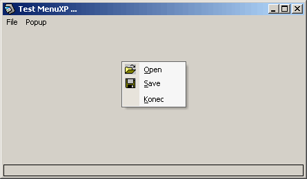



## XP Menu '2002  \(flat with shadows menu system \- alpha version\)

### Description

This is the alpha version of my XP Menu system. Menu is flat with shadow as Office XP menu. Great and simple code that using subclassing. Working only in popup menu, to test, please, right click on form ...
 
### More Info
 

             |
---                |---
**Submitted On**   |2002-04-05 00:40:04
**By**             |[Anthonius](https://github.com/Planet-Source-Code/PSCIndex/blob/master/ByAuthor/anthonius.md)
**Level**          |Advanced
**User Rating**    |4.4 (35 globes from 8 users)
**Compatibility**  |VB 5\.0, VB 6\.0
**Category**       |[Custom Controls/ Forms/  Menus](https://github.com/Planet-Source-Code/PSCIndex/blob/master/ByCategory/custom-controls-forms-menus__1-4.md)
**World**          |[Visual Basic](https://github.com/Planet-Source-Code/PSCIndex/blob/master/ByWorld/visual-basic.md)
**Archive File**   |[XP\_Menu\_'268932452002\.zip](https://github.com/Planet-Source-Code/anthonius-xp-menu-2002-flat-with-shadows-menu-system-alpha-version__1-33452/archive/master.zip)

